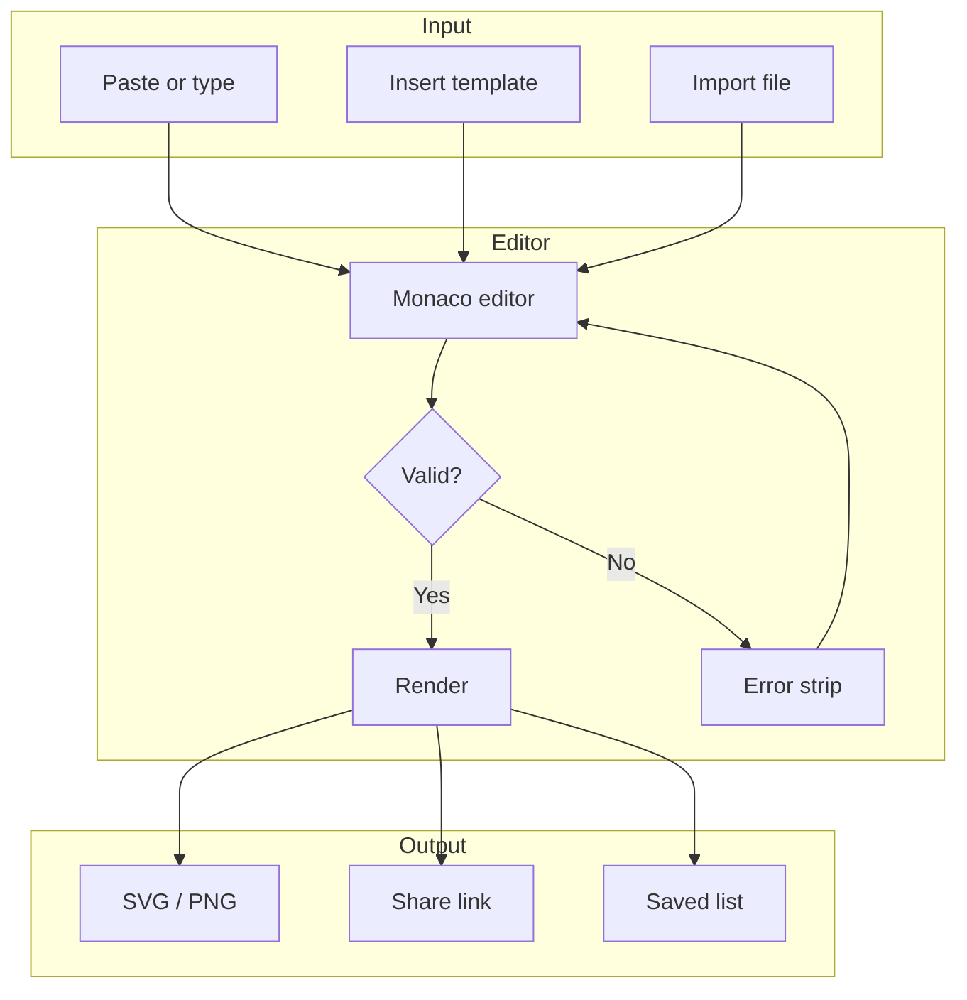

  

<h1 align="center">Diagramium</h1>

  

  
  
  
  

  <strong>Editor to create diagrams with <a href="https://mermaid.js.org">Mermaid</a>.</strong> Edit on the left, see the diagram live on the right. Don’t know the syntax? No problem—the editor has lots of examples you can use and customize as needed, plus a built-in cheat sheet.

---

## Motivation

This editor started as a personal tool: I rely on diagrams more than plain text, and [Mermaid](https://mermaid.js.org) gave the robustness, flexibility, and scalability I needed to structure ideas and fit modern workflows.

It’s built to help you create diagrams quickly—even without knowing the syntax—via built-in examples, real-time rendering as you type or paste, a minimal space-optimized layout that works online and on mobile, and instant export to SVG and PNG for sharing. Optional: plug in your own AI with `useSetDiagramFromAI()`.

---

## Scope so far

| Area | Features |
|------|----------|
| **Editor** | Split pane, Format, Undo/Redo, Snapshots, error strip, dark/light theme |
| **Examples** | Templates by type (flowchart, sequence, class, etc.), search, Recent |
| **Learn** | Syntax cheat sheet, How to use, live code → diagram feedback |
| **Diagram** | Zoom, pan, grid, appearance (background, border, theme) |
| **Export** | SVG, PNG, .md, .mmd, copy code/PNG/link, Print/PDF, import file |
| **Persistence** | Shareable `#d/<base64>`, saved diagrams (10), snapshots |

### Example (Mermaid)

The built-in examples are meant as starting points to create your own flows and diagrams. They are there to show possibilities and scope, not to mirror real systems exactly.

You can create diagrams like this in Diagramium—edit the code on the left and see the result live:

---

## Build and run

**Prerequisites:** Node.js 18+ and npm (or pnpm/yarn). Clone, then `npm install` and `npm run dev`; open **http://localhost:5173**. Production: `npm run build` → serve `dist/`, or `npm run preview` to try the build locally.

---

## Roadmap

- **Available** — Plug in your own AI with `useSetDiagramFromAI()`; inject Mermaid code from any pipeline.
- **Planned** — TBD (contributions welcome).

---

## License

MIT. Diagram rendering by [Mermaid](https://mermaid.js.org); see [Mermaid’s repo](https://github.com/mermaid-js/mermaid) for its license. Diagramium is not affiliated with the Mermaid project.
